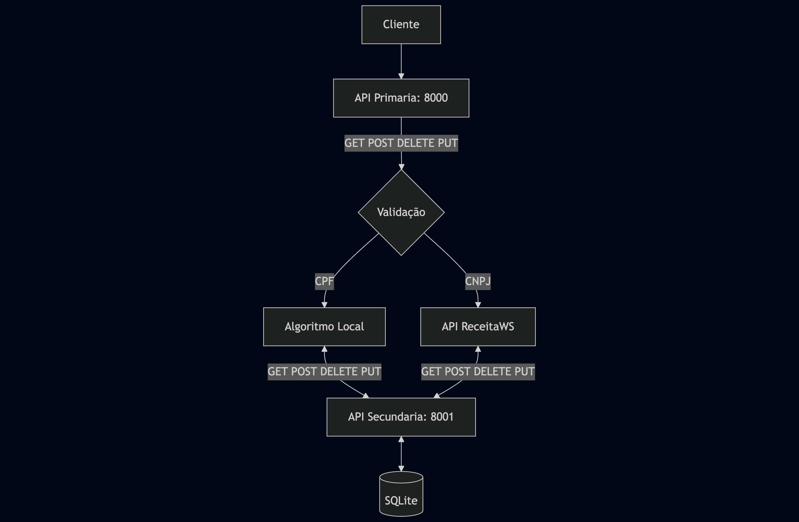

# API Primaria - API de Validação de Documentos



API REST para validação de documentos com integração de cache e consulta à (ReceitaWS)[https://developers.receitaws.com.br/#/operations/queryCNPJFree].

## 🚀 Começando

### Pré-requisitos

- Docker
- Docker Compose
- [Api-secundaria](https://github.com/o-flores/mvp-arquitetura-api-secundaria)

### Instalação

Para correta instalação do projeto lembre-se de instalar a `api-primaria` e a (`api-secundaria`)(https://github.com/o-flores/mvp-arquitetura-api-secundaria)dentro da mesma pasta. No exemplo a seguir criaremos a pasta `mvp-arquitetura` e clonaremos este projeto dentro dela.

```bash
mkdir mvp-arquitetura
cd mvp-arquitetura
git clone https://github.com/o-flores/mvp-arquitetura-api-principal.git

# Apos instalação da api-secundaria
# Iniciar containers
cd mvp-arquitetura-api-principal
docker-compose up --build
```

### Swagger

Para ter acesso aos detalhes das APIs, basta seguir os passos anteriores para rodar a aplicação e em seguida acessar o swagger pela rota:

```
http://localhost:8000/
```

### Licença

Este projeto está licenciado sob a Licença MIT - veja o arquivo [LICENSE.md](LICENSE.md) para mais detalhes.
